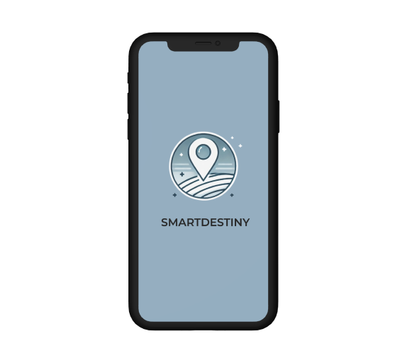
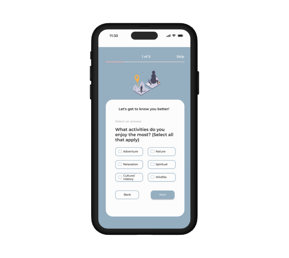
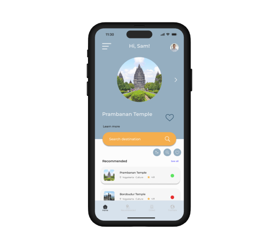
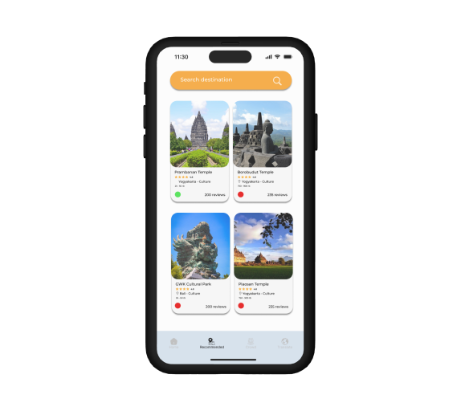

 

  

 

# SmartDestiny-Apps

GitHub Repositories of Bangkit Academy 2024 Capstone Project from 3 learning path. Machine Learning, Mobile development, Cloud Computing

# About The Project

SmartDestiny is an innovative application tailored for tourists exploring Indonesia, providing seamless access to destination information, crowd predictions, and real-time translation to enhance the travel experience. Tourists frequently encounter challenges such as finding suitable travel spots, avoiding crowded destinations, and overcoming language barriers, which can diminish the quality of their journey. SmartDestiny addresses these issues by utilizing advanced technology to offer personalized destination recommendations, crowd density predictions, and optional translation support. With data-driven insights, SmartDestiny helps tourists make well-informed decisions and plan their visits to enjoy a smoother travel experience.

  
  
  
  
  

# Team Members

## Team ID : C242-PR592

 

| Name                           | Student ID     | Path                |
| ---------------------          | ----------     | ------------------- |
| Ary Maulana Al Hakim           | M180B4KY0671   | Machine Learning    |
| Muhammad Vitro Ramadhan        | M001B4KY3111   | Machine Learning    |
| Adytia Aries Nugroho           | C763B4KY0143   | Cloud Computing     |
| Aditya Ramadhan Wahyu Santoso  | C284B4KY0114   | Cloud Computing     |
| Labibah Raihanatul Salwa       | C183B4KX2245   | Cloud Computing     |
| Wahyu Chandra                  | C251B4KY4454   | Cloud Computing     |
|  Ilham Maroof Sutrisno         | A012B4KY1941   | Android Development |

 

# Resource

In our project is divided into four branches.

1. [main](https://github.com/chand-19/SmartDestiny-Apps/tree/main)
2. [android-development](https://github.com/chand-19/SmartDestiny-Apps/tree/android-development)
3. [cloud-computing](https://github.com/chand-19/SmartDestiny-Apps/tree/cloud-computing)
4. [machine-learning](https://github.com/chand-19/SmartDestiny-Apps/tree/machine-learning)

# Technology Used

1. Machine Learning
   - [Tensorflow](https://www.tensorflow.org/)
   - [Python](https://www.python.org/)
2. Android Development
   - [Kotlin](https://kotlinlang.org/)
   - [Firebase](https://firebase.google.com/)
3. Cloud Computing
   - [Flask](https://flask.palletsprojects.com/)
   - [Google App Engine](https://cloud.google.com/appengine)
   - [Google Firestore](https://cloud.google.com/firestore)
   - [Google Cloud Run](https://cloud.google.com/run?hl=id)
   - [Google Cloud Storage](https://cloud.google.com/storage?hl=id)
4. Design
   - [Figma](https://www.figma.com/design/JcpgwadSWwRsUZPzTwaxt7/Smart-Destiny?node-id=0-1&p=f&t=Pwj03WfAJ7FWaNt4-0)
      
